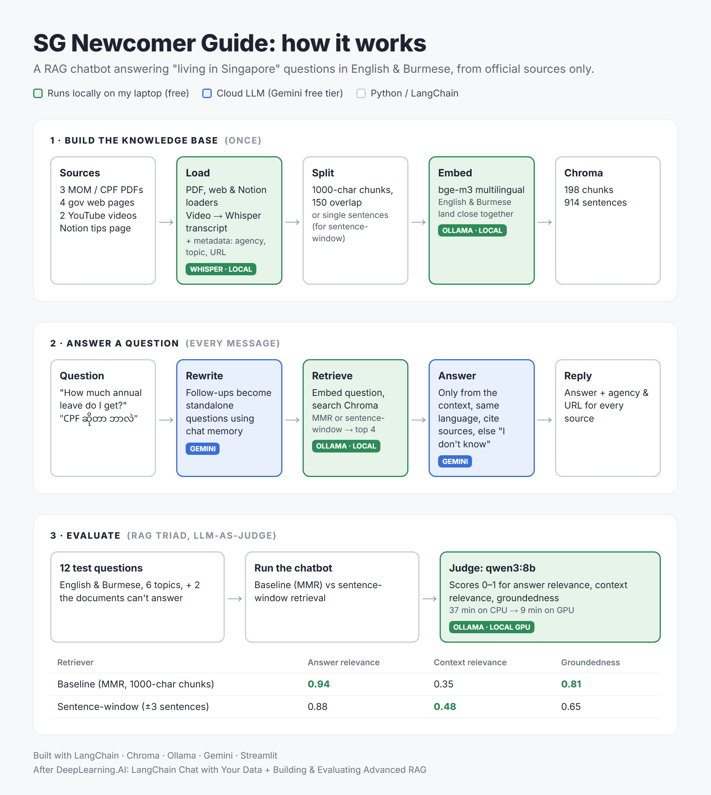

# SG Newcomer Guide

**Ask about life in Singapore in English or Burmese, and get answers from
official government sources, with citations.**

**[▶ Try the live demo](https://huggingface.co/spaces/kZarT/sg-newcomer-guide)** (Hugging Face Space; may take a few minutes to wake up)


- **End-to-end RAG pipeline:** ingests PDFs, government web pages, YouTube
  videos (transcribed with Whisper) and Notion notes, then answers with cited
  sources or says "I don't know"
- **Multilingual:** local `bge-m3` embeddings let a Burmese question find
  English documents, and answers come back in the language of the question
- **Measured, not guessed:** a RAG-triad evaluation (12 questions, local LLM
  judge) compares the baseline with sentence-window retrieval.
  [See the results](#results), including where the "advanced" method lost
- **Practical engineering:** works within the Gemini free tier (fallback
  models, batching, and local models for embeddings and the judge), with chat
  memory and a Streamlit UI that shows the retrieved chunks



A multilingual (English/Burmese) RAG chatbot answering practical
"living in Singapore" questions (work, CPF, housing, transport, healthcare).
Learning project built after DeepLearning.AI's
"LangChain Chat with Your Data" and
"Building and Evaluating Advanced RAG" courses.

⚠️ Always confirm information on the official websites.


## Why

Information for newcomers is spread across many government websites (MOM,
CPF, HDB, LTA...) and is mostly in English. I wanted to apply what I learned
in the two courses to a real problem: one place to ask, in English or Burmese,
with answers that point back to the official source.


## Features

- **4 kinds of sources**: official PDFs, government web pages, YouTube videos
  (transcribed locally with Whisper) and a Notion page of personal tips
- **Multilingual search**: local `bge-m3` embeddings, so a Burmese question
  finds English documents
- **Several retrievers**: similarity search, MMR, metadata filters,
  self-query, contextual compression, sentence-window
- **Answers with sources**: the LLM answers only from the retrieved chunks,
  in the language of the question, and lists the agency and URL
- **Chat memory**: follow-up questions ("what if I worked less than a year?")
  are rewritten into standalone questions before searching
- **Evaluation**: RAG triad (answer relevance, context relevance,
  groundedness) scored by a local LLM judge
- **Web chat** (Streamlit) that shows the retrieved chunks for every answer


## How to run

No GPU needed. Everything runs on the CPU; a GPU only makes evaluation faster.

### 1. Install

You need [Python 3.10+](https://www.python.org/),
[ffmpeg](https://ffmpeg.org/) (for the video transcripts), a free
[Gemini API key](https://aistudio.google.com/apikey) and, for the
evaluation only, [Ollama](https://ollama.com/). The `bge-m3` embedding model
(~2.2 GB) downloads automatically the first time.

```powershell
git clone https://github.com/khine282/sg_newcomer_guide.git
cd sg_newcomer_guide
python -m venv .venv
.venv\Scripts\activate
pip install -r requirements.txt

ollama pull qwen3:8b    # evaluation judge (only needed for step 5)

copy .env.example .env  # then put your Gemini key in .env
```

### 2. Download the PDFs

The PDFs are not in the repo. Download them into `data/raw/pdfs/`:

```powershell
mkdir data\raw\pdfs
cd data\raw\pdfs
curl.exe -L -A "Mozilla/5.0" -o cpf_contributions_guide.pdf https://www.cpf.gov.sg/content/dam/web/member/infohub/documents/Brochure_MakingCPFContributionsCorrectlyAndPromptly.pdf
curl.exe -L -A "Mozilla/5.0" -o mom_foreign_workers_guide.pdf https://www.mom.gov.sg/-/media/mom/documents/statistics-publications/a-guide-for-foreign-workers-english-malay.pdf
curl.exe -L -A "Mozilla/5.0" -o mom_workright_employment_laws.pdf https://www.mom.gov.sg/-/media/mom/documents/employment-practices/workright/workright-guide-employment-laws.pdf
cd ..\..\..
```

### 3. Build the knowledge base

```powershell
$env:PYTHONIOENCODING="utf-8"      # so Windows can print Burmese text
python -m ingest.load_all          # load all sources (downloads + transcribes the videos)
python -m ingest.split_documents   # split into chunks
python -m rag.vectorstore          # embed the chunks into Chroma
python -m rag.sentence_window      # optional: sentence index for sentence-window retrieval
```

### 4. Chat

```powershell
streamlit run app.py      # web chat
python -m rag.chat        # or chat in the terminal
```

Try: "How much annual leave do employees get?", then "What if I have worked
less than a year?", or a Burmese question like "စင်ကာပူမှာ ဖုန်းဆင်းကတ် ဘယ်မှာဝယ်ရမလဲ".

### 5. Evaluate (optional)

```powershell
python -u -m eval.rag_triad baseline
python -u -m eval.rag_triad sentence_window
```

Each run uses 12 Gemini requests. It takes about 9 minutes with a GPU, and
about 35 minutes on the CPU.


## Results

12 test questions (English and Burmese, 6 topics, plus 2 questions the
documents can't answer), each scored 0-1 by a local `qwen3:8b` judge:

| Retriever | Answer relevance | Context relevance | Groundedness |
|---|---|---|---|
| Baseline (MMR, 1000-char chunks) | **0.94** | 0.35 | **0.81** |
| Sentence-window (±3 sentences) | 0.88 | **0.48** | 0.65 |

- Sentence-window retrieves **more relevant context**, but on this data it
  did **not** give better answers
- It breaks **tables**: the polyclinic price table was split into "sentences",
  the consultation fee row was lost, and the bot said "I don't know"
  (the baseline answered it)
- It fixed one baseline failure: the baseline answered "What is CPF?" in
  Burmese with "I don't know", because MMR missed the definition sentence
- The judge is a small local model and is noisy (for example, it can't verify
  claims supported by Malay text), and 12 questions is a small test set, so
  small differences don't mean much

Full results: [`eval/results/`](eval/results/)


## Project structure

```
ingest/     load PDFs, web pages, videos, Notion -> split into chunks
rag/        vector store, retrievers, QA chain, chat with memory
eval/       test questions + RAG triad evaluation
app.py      Streamlit web chat
data/       sources.yaml (what to load) and the Notion export
```


## How I built it (phase by phase)

One phase per branch and pull request.

### Phase 1: Document loading
- Sources: 3 PDFs (MOM and CPF guides), 4 web pages (CPF, LTA, CEA,
  SingHealth Polyclinics), 2 CPF videos, 1 Notion page of personal tips
- Loaders used: PyPDFLoader, WebBaseLoader, GenericLoader + local Whisper, NotionDirectoryLoader
- Every document has metadata: topic, agency, source type, source URL, last checked date
- Problems I hit:
  - Some government pages (MOM, HDB) load content with JavaScript, so the loader got 0 characters. I removed them and used PDFs or other official pages instead
  - Web pages included menus and footers; I removed nav/header/footer tags before extracting text
  - A 33 second promo video gave almost no transcript (Whisper only transcribes speech); I replaced it with a longer explainer
  - Some PDF pages were nearly empty; I filter out documents under 100 characters
- Data is imbalanced: most documents come from MOM PDFs

### Phase 2: Splitting
- RecursiveCharacterTextSplitter (1000 characters, 150 overlap), and
  MarkdownHeaderTextSplitter for the Notion page so each chunk keeps its header
- 86 documents -> 198 chunks

### Phase 3: Embeddings and vector store
- Chroma vector store
- Started with Gemini embeddings, then switched to local `bge-m3` (first in
  Ollama, later with `sentence-transformers` so it also runs when deployed):
  the free tier allows only 1000 embeddings per day, not enough to rebuild
  indexes while experimenting
- Duplicated the CPF PDF on purpose (like the course) to show similarity
  search returning duplicates

### Phase 4: Retrieval
- MMR removes the duplicates and gives more varied results
- Metadata filter (e.g. `topic=transport`)
- Self-query: the LLM builds the filter from the question, even in Burmese
  (it picked `topic=healthcare` for a Burmese question about seeing a doctor)
- Contextual compression: the LLM keeps only the relevant part of each chunk

### Phase 5: Question answering and chat
- "Stuff" QA chain: each chunk is shown to the LLM with its agency and URL so
  it can cite them; same language as the question; "I don't know" when the
  answer isn't in the documents
- Chat with memory: follow-up questions are rewritten using the chat history
  before searching; only the last 5 turns are kept
- Gemini fallbacks: free-tier models often return 503, so the code tries
  several models in turn

### Phase 6: Evaluation and advanced retrieval
- RAG triad with my own judge prompts (instead of TruLens), so I can see
  exactly how grading works
- Judge runs locally (`qwen3:8b`), because the Gemini free tier allows only
  20 chat requests per day per model and one run needs ~36 grading calls
- Sentence-window retrieval, compared with the baseline (see Results)
- Judge on GPU: 37 min -> 9 min per run, after an NVIDIA driver update fixed a
  CUDA error


## Lessons learned

- **Measure, don't assume.** The "advanced" technique improved retrieval but
  not the answers on my data. Without evaluation I would have assumed it was
  better.
- **Free-tier limits shape the design.** Daily quotas pushed me to run
  embeddings and the judge locally and keep the cloud LLM for answers only.
- **Real documents are messy.** JavaScript-only pages, menus in the text,
  tables, and translated pages (Chinese/Malay) that take up retrieval slots.
- **A multilingual embedding model** lets Burmese questions find English
  documents without translating anything.


## Limitations and next steps

- Small knowledge base (mostly MOM PDFs); no HDB or ICA sources yet
- Chinese and Malay translation pages in the MOM PDF compete with English
  chunks; they should be filtered out when loading
- The judge gives an honest "I don't know" a low groundedness score
- Next: auto-merging retrieval (Course 3), more test questions, better
  handling of tables
